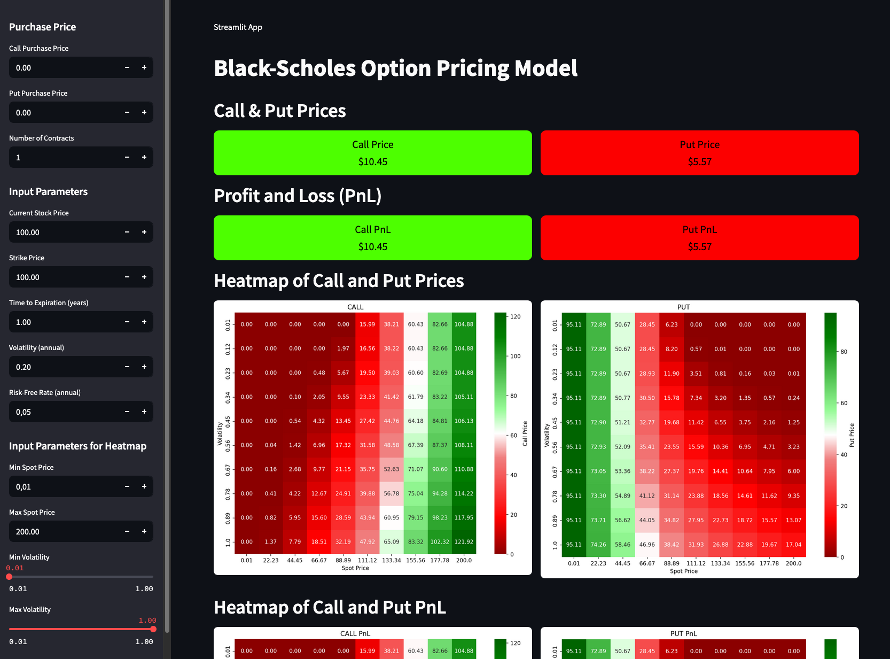

# Option_Pricer_BlackScholes

The goal of this repository is to provide a simple and interactive option pricer based on the Black-Scholes model using Python and Streamlit.

## 🧠 Project Overview

### 📊 Interactive Option Pricer – Black-Scholes
Built an UI option pricer based on Black-Scholes model



#### Key Features:
- Simple Streamlit visualization dashboard
- Fully user input for spot price, volatility, risk free rate, time to expiration, etc
- Returns CALL and PUT prices and both P&L
- Adjustments for generating heatmaps of both prices and P&L

📁 Project Files: `black_scholes_interactive.py`

## 📦 Dependencies

All dependencies are listed in the `environment.yml` and `requirements.txt`files.

To install and run in a single command:

```bash
./direct_run.sh
```

If you already have a working Python environment set up, you can run using:
```bash
streamlit run black_scholes_interactive.py
```